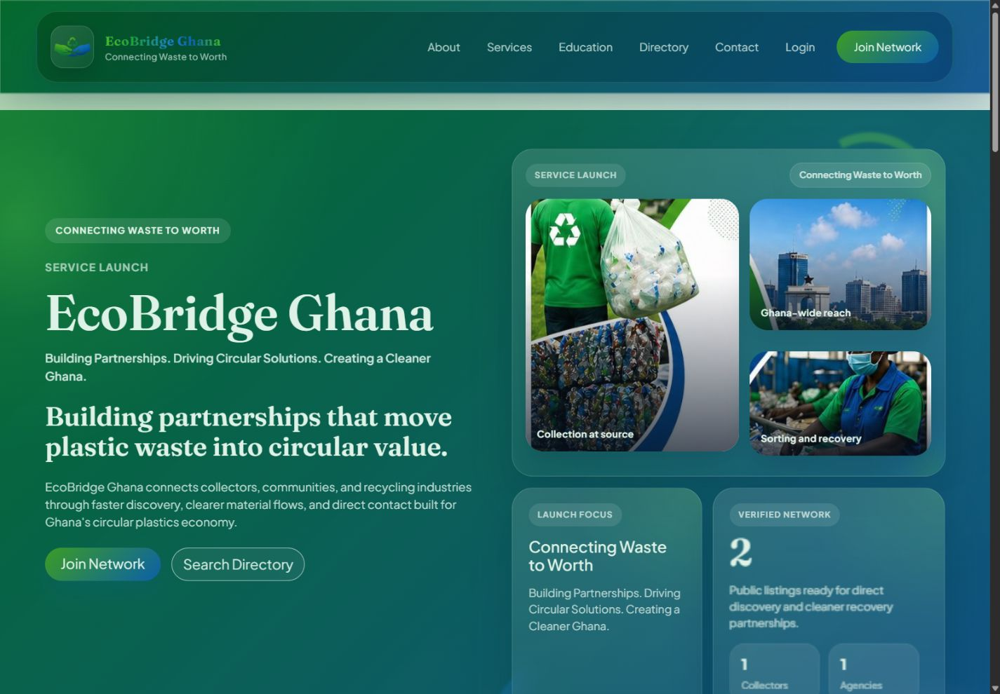
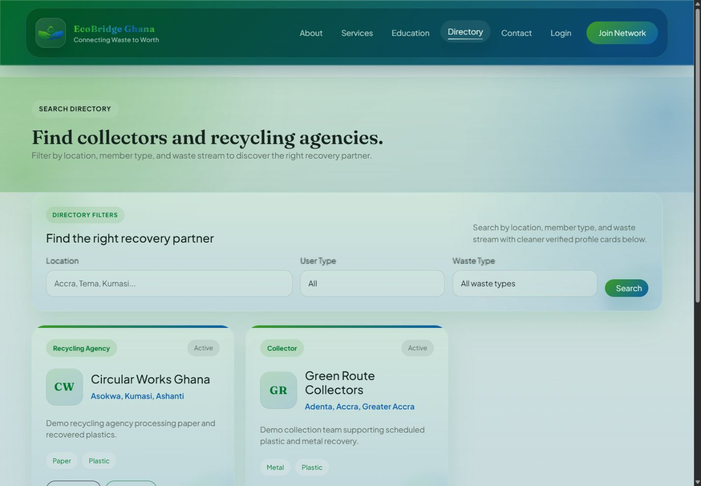
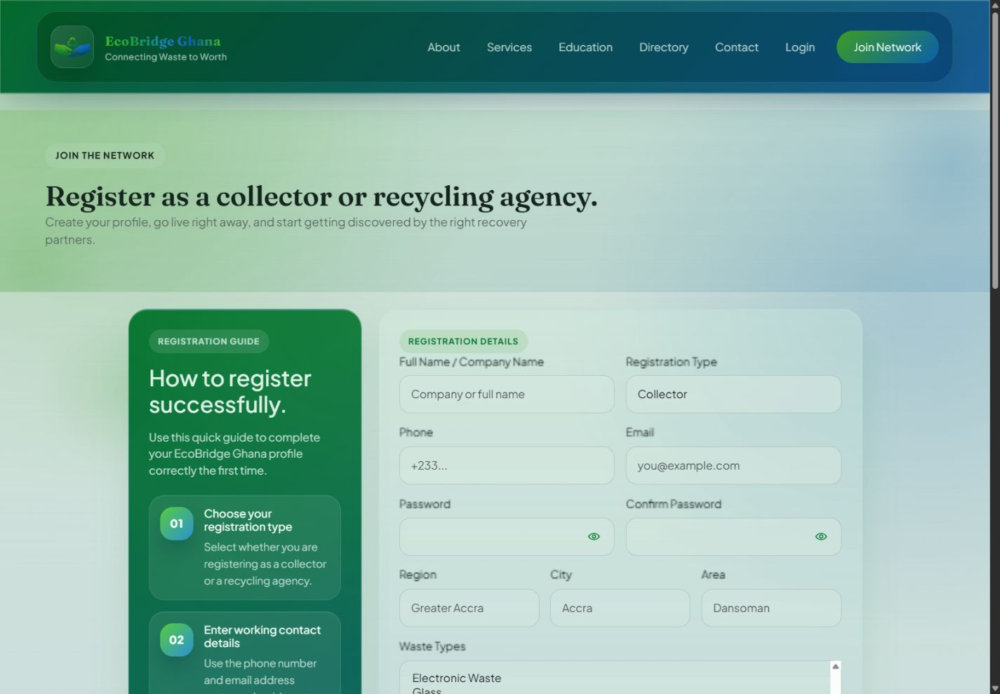

# EcoBridge Ghana

EcoBridge Ghana is a Flask web application that connects waste collectors and recycling agencies through searchable public profiles, direct contact routes, and a lightweight admin dashboard. The project is presented as a portfolio-ready MVP for a digital recycling marketplace.

## Key Features

- Public pages for Home, About, Services, Education, Directory, and Contact
- Collector and recycling-agency registration with immediate profile access
- Public member profiles with location, waste types, contact details, and optional logo/photo uploads
- Searchable directory with filters for location, user type, and waste stream
- Direct phone, email, and WhatsApp contact actions from listing/profile pages
- Registration confirmation emails for new members
- Contact form forwarding to a configured recipient mailbox
- Admin dashboard for managing listings and reviewing submitted messages
- SEO-friendly basics including page metadata, sitemap, and robots routes
- Responsive Jinja templates with a custom green/blue visual system

## Tech Stack

- Python
- Flask
- Flask-Login
- Flask-SQLAlchemy
- Flask-WTF
- SQLite for local development
- MySQL- and PostgreSQL-compatible production configuration through `DATABASE_URL`
- Vercel Blob support for persistent profile images
- Bootstrap 5
- Custom CSS and JavaScript
- pytest

## Screenshots

All screenshots use generated demo records rather than production or client data.

### Homepage



### Searchable directory



### Member registration



## Installation

Clone the repository and move into the project directory:

```bash
git clone https://github.com/JET-KII/EcoBridge-Ghana.git
cd EcoBridge-Ghana
```

Create and activate a virtual environment:

```bash
python -m venv .venv
.venv\Scripts\activate
```

Install dependencies:

```bash
pip install -r requirements.txt
```

Copy the example environment file:

```bash
copy .env.example .env
```

## Environment Variables

Use example values only in public documentation. Put real values in your local `.env` file, which should never be committed.

| Variable | Example | Purpose |
| --- | --- | --- |
| `FLASK_APP` | `run.py` | Flask entry point |
| `FLASK_ENV` | `development` | Local development mode |
| `SECRET_KEY` | `replace-with-a-local-dev-secret` | Flask session/security key |
| `DATABASE_URL` | `sqlite:///instance/ecobridge_dev.db` | Local database connection |
| `UPLOAD_FOLDER` | `app/static/uploads` | Runtime upload directory |
| `BLOB_READ_WRITE_TOKEN` | empty | Enables persistent Vercel Blob profile-image storage |
| `MAX_CONTENT_LENGTH` | `4194304` | Upload size limit in bytes |
| `MAIL_SERVER` | `smtp.example.com` | SMTP host |
| `MAIL_PORT` | `465` | SMTP port |
| `MAIL_USE_SSL` | `true` | Use SSL for SMTP |
| `MAIL_USE_TLS` | `false` | Use TLS for SMTP |
| `MAIL_USERNAME` | `demo@example.com` | SMTP username |
| `MAIL_PASSWORD` | `change-me` | SMTP password |
| `MAIL_DEFAULT_SENDER` | `demo@example.com` | Default sender address |
| `CONTACT_RECIPIENT` | `admin@example.com` | Recipient for contact form messages |
| `MAIL_TIMEOUT` | `30` | SMTP timeout |
| `MAIL_SUPPRESS_SEND` | `false` | Set to `true` to avoid sending emails locally |
| `ADMIN_EMAIL` | `admin@example.com` | Admin account email for seeding |
| `ADMIN_PASSWORD` | `change-me-before-use` | Admin account password for seeding |
| `ADMIN_PHONE` | `+233000000000` | Optional admin phone number |

## Run Locally

Initialize the database:

```bash
flask --app run.py init-db
```

Create or update an admin account from your `.env` values:

```bash
flask --app run.py seed-admin
```

Start the development server:

```bash
python run.py
```

Open the local site at:

```text
http://127.0.0.1:5000
```

## Testing

Run the test suite:

```bash
pytest
```

The tests use isolated application configuration and should not require production credentials.

## Vercel Deployment

The repository includes a Flask entry point in `api/index.py` and routing in `vercel.json`.
The Vercel deployment uses:

- Neon Postgres through `DATABASE_URL`
- Public Vercel Blob storage through `BLOB_READ_WRITE_TOKEN`
- Local uploads as a fallback outside Vercel

Initialize a newly provisioned database with:

```bash
python scripts/init_database.py
```

## Public Repository Safety

Do not commit local secrets, generated files, private media, live databases, real user uploads, deployment archives, or client-only documents. The `.gitignore` is intentionally conservative and excludes local databases, `.env` files, uploads, campaign media, team portraits, generated presentations, video workspaces, and deployment ZIP files.

Only include real client/team images in a public repository if the client has explicitly approved them for public source-code hosting. If approval is unclear, use sanitized placeholder images or omit those assets from the public repo.

## Project Status

This project is an MVP/demo web platform prepared for portfolio and public GitHub presentation. It is suitable for local review and demonstration, but production deployment still requires secure environment variables, a production database, HTTPS hosting, SMTP credentials, and client approval for any public media assets.

## Repository

[View EcoBridge Ghana on GitHub](https://github.com/JET-KII/EcoBridge-Ghana)
